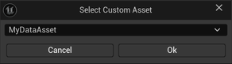
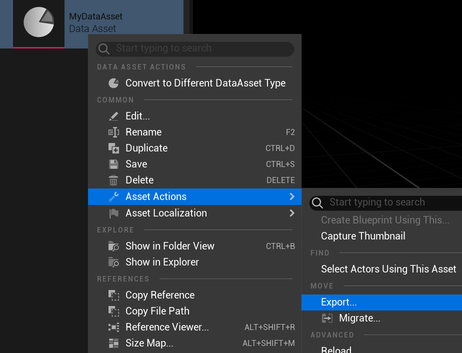

# YamlDataAsset

A plugin for the Unreal Editor that allows you to convert between UDataAssets and YAML files.

This makes it easier to swap between Unreal and external data sources.

## Installation

* Like any plugin, clone this repository into the `Plugins` directory and compile into your project.

* You may also need to enable it in the plugins settings (`Edit->Plugins->Project->Editor`).

 
## Usage

### To Import

* Drop a YAML file into the content browser.
* Select the asset type from the list.
* Click OK.



### To Export

* Choose export from the `Asset Actions` menu, choose YAML.




## Example

### UMyDataAsset

```c++
UCLASS( BlueprintType )
class UMyDataAsset : public UDataAsset
{
	GENERATED_UCLASS_BODY()

	UPROPERTY( EditAnywhere )
	FName Name;

	UPROPERTY( EditAnywhere )
	TArray<int> SomeNumbers;
};
```

### YAML

```yaml
Name: MyName
SomeNumbers:
  - 4
  - 8
  - 15
  - 16
  - 23
  - 42
```

The plugin uses the Unreal reflection system walk the properties and set the values. It is recursive, so it will work with nested structures, collections and compound types. Property names are case-insensitive.

## Notes

### __uclass

You can put a `__uclass` property at the top of the file to let the plugin know the class to use. If the UDataAsset exists then it will skip the dialog box. For example:

```yaml
__uclass: MyDataAsset
Name: MyName
SomeNumbers:
  - 4
  - 8
  - 15
  - 16
  - 23
  - 42
```

### Compound Keys

A `TMap` with a compound key type (a struct as a key, e.g. `TMap<FMyCustomKey,FString>`) is not supported. Whilst this is allowed in Unreal, JSON (and therefore YAML) only allow value types in the file format (this is a JavaScript limitation).
